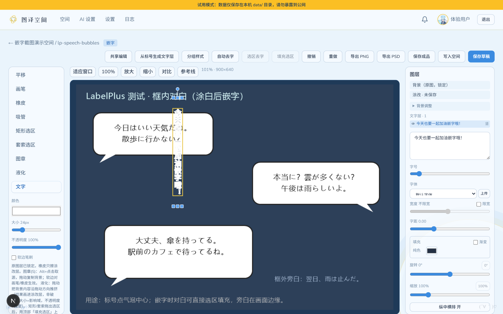
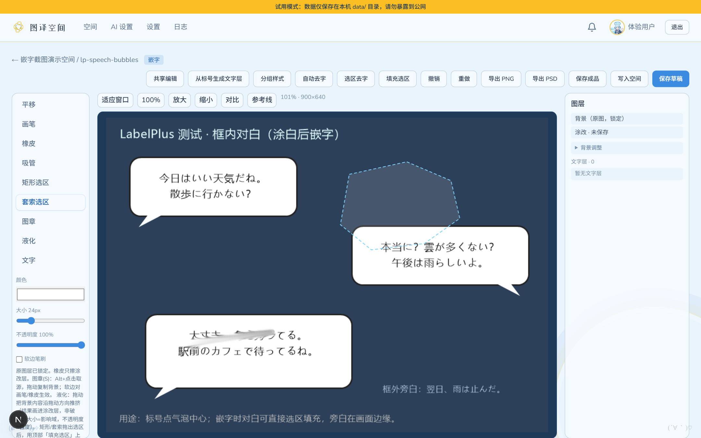
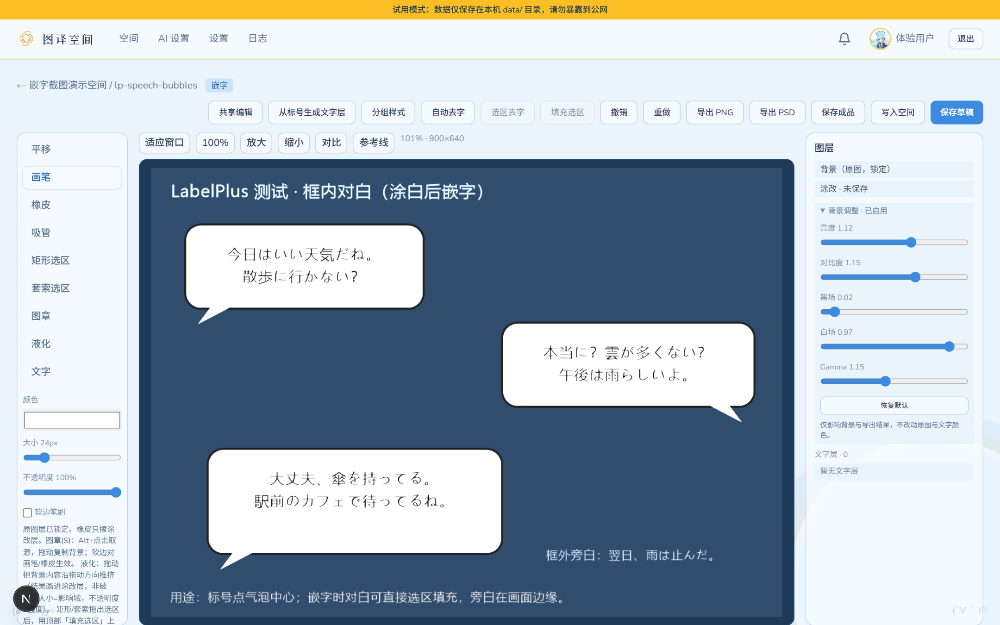

# 图译空间（Tuanyi-Space）完整使用手册

> 本指南参考汉化组通用协作规范编撰，旨在帮助翻译、校对、嵌字及汉化组长快速上手图译空间。

---

## 目录
- [（序）介绍与定位](#序介绍与定位)
- [（一）快速上手：免安装便携版 vs 团队协同版](#一快速上手免安装便携版-vs-团队协同版)
- [（二）空间与项目管理](#二空间与项目管理)
- [（三）翻译与校对工作流（在线标注）](#三翻译与校对工作流在线标注)
- [（四）AI 智能翻译辅助（OCR + 检测 + 翻译）](#四ai-智能翻译辅助ocr--检测--翻译)
- [（五）嵌字工作流：Web 在线嵌字 vs PS 脚本上字](#五嵌字工作流web-在线嵌字-vs-ps-脚本上字)
  - [工作流 A：内置 Web 嵌字器（AI 擦除 + 网页排版一键出图）](#工作流-a内置-web-嵌字器ai-擦除--网页排版一键出图)
  - [工作流 B：LabelPlus + Photoshop 自动化脚本协同](#工作流-blabelplus--photoshop-自动化脚本协同)
- [（六）AI 供应商配置指南](#六ai-供应商配置指南)
- [（七）协作可见性与效率工具](#七协作可见性与效率工具)
- [（八）常见问题与避坑指南（FAQ）](#八常见问题与避坑指南faq)

---

## （序）介绍与定位

**图译空间（Tuanyi-Space）** 是一款面向漫画、插画与条漫汉化团队的现代化在线协作翻译与排版平台。

过去汉化组通常需要结合多种工具（如 LabelPlus 打标客户端、FTP/网盘传图、QQ 群传 txt、Photoshop 逐页手动嵌字），环节繁琐且容易撞车。图译空间吸收了 **萌翻（MoeFlow）** 与 **彩翻（CaiFan）** 在多人协同、标号管理上的优秀经验，并在此基础上实现了革命性的突破：**将“文字标注、AI 翻译、智能去字（Inpainting）与在浏览器中直接完成嵌字出图”全链路一体化整合！**


### 核心特性对比一览

| 能力模块 | 传统单机（LabelPlus） | 萌翻 / 彩翻 | 图译空间（Tuanyi-Space） |
| :--- | :--- | :--- | :--- |
| **部署与运行** | Windows 本机客户端 | 复杂 Docker/多容器集群 | **双模**：单机绿色便携包（开箱即用）/ 团队公网服务 |
| **协同打标** | 仅单人本地打标 | 网页多人在线协作 | **网页实时多人协同**（支持加锁、实时状态广播） |
| **制作人员流转** | 手动记录 | 角色栏显示与状态记录 | **空间制作人员独立字段（作者/翻译/校对/嵌字）+ 7 级细粒度进度状态** |
| **PS-Script 导出** | 支持原版 `翻译_0.txt` | 需转换导出 `translations.txt` | **100% 原生对齐 `images/翻译_0.txt`**，解压即用 |
| **AI 识别与翻译** | 无 | 支持配置 API 跑大模型（鸠三样） | **多 Provider 切换 + 术语表（Glossary）注入 + Sidecar 检测管线** |
| **Web 在线嵌字** | ❌ 无 | ❌ 无（必须导出到 PS） | **✅ 原生支持！** 浏览器内字体排版、字号微调、横竖混排 |
| **AI 智能去字修图** | ❌ 无 | ❌ 无（需人工在 PS 修图） | **✅ 原生支持！** 集成 LaMa / IOPaint AI 消除原图文字 |

---

## （一）快速上手：免安装便携版 vs 团队协同版

图译空间提供两种使用姿态：

### 1. 单人/本地试用模式（Portable 绿色版）
适合个人汉化、单兵作战或临时本地处理。
- 从 GitHub Releases 下载 `tuanyi-space-trial-win64.zip`；
- 解压到任意独立文件夹，双击 `start.bat`；
- 系统会自动拉起内置运行时并在浏览器打开 `http://localhost:3000`；
- **免登录、无需注册**，数据全部保存在解压目录下的 `data/` 文件夹中。

### 2. 团队公网协同模式
适合多人汉化组共享服务器协作。
- 管理员按照 README 部署在云服务器或局域网；
- **邀请注册制**：普通成员需凭管理员生成的**邀请码**注册账号；
- 登录后可在个人中心（右上角头像）设置自己的昵称与个性头像。

---

## （二）空间与项目管理

空间（Space）即一个汉化项目（如单行本的一话、一篇短篇或一本同人本）。


1. **新建空间**：
   - 在空间管理页点击「新建空间」；
   - 填写空间名称（如 `[水城] 某日常篇 第01话`）、描述与标签（如 `日常`、`纯爱` 等）。
   - 系统将自动生成全局唯一的空间序号（格式为 `YYYYMMDD-NN`，方便群内汇报交流）。
2. **制作人员认领与登记**：
   - 空间详情页支持记录四个核心栏目：**作者、翻译、校对、嵌字**；
   - 组内成员可随时编辑填入自己或搭档的 ID，空间列表支持按制作人员一键检索，再也不用担心“这篇是谁翻的/谁在嵌”。
3. **七级协同进度体系**：
   - 空间支持 7 级标准化流转状态：
     - `未翻译` → `翻译占坑` → `已翻译`
     - → `校对占坑` → `已校对`
     - → `嵌字占坑` → `嵌字完成`
   - 卡片上会实时展示「当前状态已维持 X 天」，组长一眼即可洞察各作品的排期卡点。
4. **批量上传图源**：
   - 支持直接拖拽几十甚至上百张图片批量上传；
   - 自动读取图片原始宽高并生成低带宽缩略图；
   - 支持拖拽卡片调整页面顺序（对齐漫画阅读顺序）。

---

## （三）翻译与校对工作流（在线标注）

点击空间内的任意图片条目，即可进入**在线标注与翻译编辑器**。


### 1. 基础标号与快速标号模式
- **矩形框选模式（快捷键无）**：在画布上按住鼠标左键拖拽框选台词气泡，选中后可缩放把手；
- **快速标号模式（快捷键 W）**：
  - **左键单击空白处**：直接在点击位置落下「框内（第 1 组）」图钉标号，右侧自动聚焦对应文本框，单手点选即可开始打字；
  - **右键单击空白处**：直接在点击位置落下「框外 / 旁白（第 2 组）」图钉标号；
  - **左键点击已有标号**：自动选中该标号并平滑滚动聚焦到右侧译文输入框；
  - **右键点击已有标号**：直接呼出快捷浮层菜单，一键「标记/取消存疑」或「删除标号」；
- **快捷漫画排版符号条**：
  - 在右侧译文输入区顶部常驻日漫专用符号条：`「` `」` `『` `』` `……` `♥` `♪` `★` `！？` `—` `～` `（` `）`；
  - 点击任意符号，无缝插入当前获得焦点的文本框光标处（保持输入焦点不丢失），彻底解决输入法频繁切换符号的繁琐痛点；
- **实时自动保存与制作人员动作自动填充**：
  - 所有标注和文字修改毫秒级自动入库；
  - **智能身份补全**：当你在空间保存第一笔译文时，若空间「翻译」为空，系统会自动填入你的昵称；切换为已校对时若「校对」为空会自动填入校对人；导出成品时若「嵌字」为空会自动填入嵌字人。

### 2. 高效快捷键表
| 快捷键 | 功能描述 |
| :--- | :--- |
| `W` | 切换为 **快速点选标号模式**（左键框内、右键框外） |
| `Q` | 切换为 **浏览平移模式** |
| `E` | 切换为 **快速录入打字模式** |
| `R` | 切换为 **审校对比模式**（悬浮即看原文与译文对比） |
| `Alt + X` | **切换疑点标记**（高亮标黄，方便校对和嵌字重点复核复杂双关或生僻字） |
| `Delete` / `Backspace` | 删除当前选中的标注框 |
| `Ctrl + S` | 强制触发即时保存（正常已有自动保存兜底） |
| `Space + 拖动` | 画布平移抓手 |
| `滚轮 / 双指` | 缩放画布视图（最大支持 800% 细节特写） |

### 3. 多人防撞车机制
- 房间右上角显示当前共同编辑成员头像；
- 当有成员正在该页标注时，系统自动锁定协同锁，防止多人同时修改产生译文覆盖；心跳超时后自动安全释放。

---

## （四）AI 智能翻译辅助（OCR + 检测 + 翻译）

图译空间内置成熟的 AI 辅助流水线（俗称“鸠三样”进阶版）：


1. **单页识别并翻译**：
   - 在标注器右上角点击「AI 翻译」；
   - 系统将自动提取画面、调用视觉大模型检测日文台词框、识别日文生肉原句，并直接给出地道的中文译文。
2. **空间内多选一键批量 AI 处理**：
   - 在空间详情页勾选任意多张生肉图片，点击批量操作栏的 **「🤖 批量 AI 处理」**；
   - 系统队列并发调用视觉检测 + OCR + 大模型翻译，进度实时可见，一键将整批漫画推进至初翻完成状态。
3. **术语表（Glossary）注入**：
   - 空间支持配置专属术语对照表（如角色名、世界观专有名词、技能名称）；
   - 在 AI 识别与翻译阶段，系统会自动将术语表作为上下文约束注入 Prompt，保证专有名词全篇翻译严格一致。
4. **校对与采纳**：
   - AI 结果返回后，以候选框的形式叠加显示；
   - 翻译人员可逐个复核、点击「采纳」合并至正式标注列表，或人工做润色调整。

---

## （五）全能嵌字工作流：分层 PSD 直出 vs Web 嵌字 vs PS 脚本

图译空间支持三套现代化嵌字流程，自由满足各类汉化组的生产习惯：

### 工作流 A：【降维创新】直接批量导出分层 PSD 压缩包（免跑脚本、开箱即用）
> **推荐指数**：⭐⭐⭐⭐⭐（重度连载汉化组强烈推荐）
- 在空间详情页点击「导出」→ 选择 **「🎨 导出分层 PSD 压缩包」**；
- 系统底层原生基于 `ag-psd` 高性能引擎，直接组装生成原生 Photoshop `.psd` 文件并打包为 ZIP；
- **核心优势**：
  - **无需在 PS 运行任何 JSX 脚本**，规避所有脚本兼容与权限问题；
  - 每个气泡在 PSD 内部自动生成为**原生 TypeTool 文本图层**，并精确锚定在气泡坐标；
  - 嵌字人员解压后直接双击 `.psd` 文件，在 Photoshop 中直接艺术排版，生产力翻倍！

### 工作流 B：内置 Web 嵌字器（AI 擦除 + 网页排版一键出图）
> **适用场景**：条漫、推特短篇、日常单页、无复杂背景特效字、追求极致时效的作品。无需安装 Photoshop，手机/平板/网页均可完成全流程！


1. **进入排版工作台**：在条目页或详情页点击「在线嵌字」；
2. **文字样式调优**：
   - 快速切换**竖排**（日漫传统）或**横排**；
   - 调整字号比例、文本对齐方式（居中、左对齐）；
   - 设置文字颜色、描边粗细与描边颜色（黑字白边/白字黑边一键切换）；
   - 字体选择：支持思源黑体、思源宋体以及组内上传的各种个性 TTF 字体；
3. **画布变换手柄与就地编辑**：
   - 切到「文字」工具并选中文字层后，画布上出现 **8 向手柄**（四角与上下 = 拖拽**等比缩放**、
     左右 = 拖拽调整**限宽换行**，竖排层自动隐藏左右手柄）与顶部**旋转手柄**（拖拽绕文本块中心
     旋转，跨 ±180° 无跳变）；手柄大小不随画布缩放变化，拖拽实时预览、松手自动入撤销栈并同步协作端；
   - **双击**任意文字层即可在画布上就地编辑文字（`Enter` 提交、`Shift+Enter` 换行、`Esc` 取消，
     点空白处失焦同样提交）；
   - 只读模式（他人持锁未共享编辑权）下手柄与双击编辑自动禁用。

   
4. **去字修图（三级引擎 + 多种蒙版来源）**：
   - **自动去字**：涂改层**有笔迹**时直接把笔迹当蒙版（画过的地方 = 要去字的地方，任意颜色笔迹均可，
     橡皮擦掉的部分不算）；无笔迹时回退按标号位置自动去字；
   - **选区去字**：用「矩形选区 / 套索选区」拖出任意形状选区（虚线框常驻显示，`Esc` 取消），
     点顶部「**选区去字**」只清除选区内的文字——比整框覆盖更贴合异形气泡与散落文字；
   - 「**填充选区**」按钮承接旧版「矩形/套索松手即填」的上色操作（现在由按钮触发，
     可以先选区再决定去字还是填充，二选一）；
   - 引擎自动走 **LaMa 本地模型 → AI 生成式（含蒙版外漂移校验）→ telea / 洋葱剥皮确定性兜底**
     三级链路，蒙版支持任意形状；
   - **液化**：按住拖动把背景内容沿拖动方向平滑推挤（向前变形，软边径向衰减），结果画进涂改层——
     不动原图、橡皮可擦，适合整理气泡边缘、网点错位与轻微构图修正；笔刷「大小」= 影响域，
     「不透明度」= 强度；
   - **笔刷手感与动态**（画笔/橡皮生效，图章保持硬边正圆）：
     - 左栏「常规」分组：**硬度**（0~100 连续渐变，替代旧「软边」开关）与**流量**
       （100 = 逐章叠加的旧手感；<100 时低流量逐章堆积出喷枪感，笔画总浓度封顶在不透明度值）；
       **间距**（1~500%，章距疏密）与**平滑**（0~95%，输入点 EMA 稳定、笔迹更顺但略滞后）
       收在「更多设置」勾选框里；
     - 左栏「笔尖与动态」分组：**角度/圆度**组成**椭圆笔尖**（圆度 100 = 正圆）、
       **散布**（0~500%，章位置随机散开，偏移幅度上限 = 笔刷大小 × 散布%，逐轴独立）、
       **大小抖动**（0~100%，章大小随机缩放）；
     - **大小压感 / 不透明度压感**两个开关：数位板压感生效（p∈[0,1] 映射到 0.65~1 倍），
       鼠标恒按 0.5 处理；以上参数全部随笔画实时同步协作端，观众看到的效果与操作者逐像素一致。

   
5. **背景调整（非破坏色阶）**：
   - 右栏「背景调整」折叠面板提供 **亮度 / 对比度 / 黑场 / 白场 / Gamma** 五个滑条 + 一键恢复默认；
   - 预览与导出走**同一条 LUT 曲线**（逐像素一致），只作用于背景图层——涂改层笔迹与文字颜色
     **不会被调**；
   - 全部默认时不产生任何像素差异；参数随嵌字草稿保存、并实时同步到协作端观众。

   
6. **直出成品**：
   - 排版完成后点击「导出成品」，直接生成高质量 PNG/JPEG 成果图；
   - 空间详情页支持「一键打包导出全部已嵌图片」，直接交付发布；
   - 「导出 PSD」：能映射的文字层升级为 **原生 TypeTool 文本图层**（PS 打开双击即可改字，
     无需逐层栅格化），带渐变 / 阴影 / 纵中横排的层自动栅格兜底，混合输出。

### 工作流 C：LabelPlus + Photoshop 自动化脚本协同
> **适用场景**：习惯跑传统 PS-Script 自动化脚本的嵌字组。


1. **导出与脚本下载**：
   - 在空间详情页点击右上角「导出」；
   - 弹窗内置 **「📥 下载配套 PS 嵌字脚本 (.jsx)」** 一键直下（内置开箱即用的 `LabelPlus_Ps_Script.jsx`）；
   - 选择 **「导出工程 ZIP」**，图片已自动经过标准化命名（`001.jpg`、`002.png`）并彻底清洗 Emoji / 非法字符。
2. **标准目录解压**：
   - 解压下载的 ZIP 包，目录结构如下：
     ```text
     [20260905-01] 某日常篇 第01话/
     ├── README.txt           # 空间信息与使用指引
     └── images/              # 原图与打标数据严格同级
         ├── 001.jpg
         ├── 002.png
         └── 翻译_0.txt       # LabelPlus 标准格式翻译数据
     ```
3. **运行 Photoshop 脚本批量上字**：
   - 打开 Adobe Photoshop；
   - 将下载的 `LabelPlus_Ps_Script.jsx` 直接拖入 PS 窗口；
   - 浏览选择 `images/翻译_0.txt`，脚本会自动匹配同目录下所有生肉图片，自动生成文字图层并保存至 `output/` 文件夹。

## （六）AI 供应商配置指南

在顶部导航栏点击 **「AI 服务」**，即可按个人或全站需求配置各大主流大模型：

1. **支持的 Provider 类型**：
   - **DeepSeek**：性价比极高（如 `deepseek-chat`），推荐用于纯文本翻译；
   - **Qwen（通义千问）**：视觉多模态能力出众（如 `qwen-vl-max`、`qwen2.5-vl`），推荐用于台词检测与生肉 OCR；
   - **OpenAI / Claude / Gemini 兼容中转**：填入标准 `Base URL` 与 `API Key` 即可；
   - **本地私有化模型**：支持连接本地 Ollama、vLLM、LM Studio（如 `http://localhost:11434/v1`），完全离线零 Token 费用。
2. **参数推荐参考**：
   - 基础端点（Base URL）：`https://api.deepseek.com/v1` 或各类聚合平台端点；
   - OCR 视觉模型（OCR Model）：填入多模态视觉模型名称；
   - 翻译模型（Chat Model）：填入语言大模型名称。

---

## （七）协作可见性与效率工具（v0.2.7）

### 1. 空间进度统计 chips
- 空间详情页进度徽标旁常驻一排轻量统计：**页数 / 标号 / 已填译文 / 存疑**；
- 存疑 chip 高亮可点，直达存疑清单；数据随条目列表自动刷新。

### 2. 存疑跨页汇总（存疑清单）
- 空间详情页工具栏「**存疑清单（N）**」按钮：汇总全空间所有存疑标号（按页序 + 标号序排序）；
- 每行展示**页名 + 标号序号 + 原文/译文摘要**，点击任意一行直接跳进标注编辑器并自动定位到该标号（`?focus=` 参数）；
- 校对前先把存疑清单清空，是避免漏修的标准动作。

### 3. 全空间终检
- 空间详情页「**终检**」按钮：一键分组检查三类问题——
  - **空译文**（标号还没有译文）；
  - **存疑未清**（还挂着疑点标记的标号）；
  - **标点硬伤**（可自动修的省略号 / 多余空行 / 首尾空白，与编辑器单页「检查」同口径）；
- 每行可点击跳转对应标注逐个处理；全部通过会显示庆祝态；
- 超过 500 页的大空间自动截断（按页序检查前 500 页）并提示。

### 4. 协作通知（进度流转 / 存疑标记）
- **进度流转**：有人把空间推进到新进度时，空间其他参与者会收到铃铛通知（如「alice 把《第01话》进度推进到 已校对」）；
- **存疑标记**：保存标注时新出现的存疑标号会按页汇总成一条通知（「bob 在《第01话》的「p1」新标记 2 个存疑标号」），点击直达该页；
- 只通知空间**参与者**（编辑过标注 / 发过评论的人 ∪ 创建者），操作者本人不收；单人 / 试用模式下自动静默，不会打扰。

### 5. 术语命中提示与翻译记忆（编辑器内）
- **术语命中提示**：标号面板原文框下方，当原文包含空间术语表的词条时显示 amber 色 chips（**译词 → 备注**），
  点击即把译词追加到译文末尾，角色名 / 专有名词不用反复手打；
- **翻译记忆（TM）**：编辑器打开时自动拉取全空间的「原文 → 译文」对照（同一原文取最新一版，上限 2000 条）；
  当某标号**原文非空且译文为空**时，显示「记忆命中：<译文> [**采用**]」，点击整段写入译文（走撤销栈可回退）；
  多页重复台词、拟声词只翻一次。

### 6. 页级认领
- 空间详情页图片卡片上有「**认领**」小按钮：点击即认领该页（多人分工互不踩脚）；
  已认领的卡片显示认领人徽标（自己的高亮「我认领」）；他人已认领时也可点「认领」接手；
  自己认领的显示「取消认领」；
- 搜索框旁勾选「**只看我认领的**」即可过滤出自己负责的页面（与关键字搜索可叠加）；
- 认领 / 取消动作全程写入操作日志，组长可追溯。

### 7. 阅读器成品切换
- 空间详情页「阅读」进入全屏阅读器后，若当前页（或对页）已有嵌字成品，顶栏会出现「**原图 | 成品**」切换；
- 「成品」模式直接展示嵌字完成的成品图（不再叠加译文层），方便发布前逐页对照检查；
- 没有成品的页始终显示原图，不受切换影响。

---

## （八）常见问题与避坑指南（FAQ）

### Q1：为什么导出的 `翻译_0.txt` 必须放在 `images/` 目录下？
**A**：这是根据 [LabelPlus/PS-Script](https://github.com/LabelPlus/PS-Script) 官方规范设计的最佳实践。PS 脚本在运行加载 txt 时，默认会从“当前 txt 所在的目录”扫描待嵌字的原图。如果两者分离在不同文件夹，PS 脚本就会弹出报错“找不到对应的图片文件”。将两者统一置于 `images/` 下能实现解压即可一键运行，免去手动选图的麻烦。

### Q2：PS 脚本导入时提示“存在无法匹配的图源文件”怎么办？
**A**：通常由以下两种原因引起：
1. **文件名包含特殊 Emoji**：原图文件名中若带有颜文字或特殊表情符号，部分旧版本 Photoshop 的 JSX 引擎无法解析。在图译空间中上传时，系统会自动标准化图源命名（如 `001.jpg`、`002.png`），直接导出即可避免该问题。
2. **勾选漏页**：检查导出时是否只导出了部分图片，但在 txt 中仍保留了全本索引。图译空间的导出引擎会自动根据你勾选的图片动态剪裁 `翻译_0.txt`，确保导出的图与 txt 内容严格一致。

### Q3：手机或 iPad 可以使用图译空间吗？
**A**：完全可以！图译空间的前端界面经过移动端响应式适配。在手机或平板浏览器中访问，同样可以查看空间状态、认领制作人员，并使用触屏进行译文录入与校对。

### Q4：便携版的本地数据如何备份与迁移？
**A**：便携版的所有数据（包括 SQLite 数据库、上传的原图、生成的标注与成品）全部存放在程序根目录的 `data/` 文件夹中。只需将 `data/` 文件夹完整复制，即可在任意电脑或新版本之间无缝迁移！
