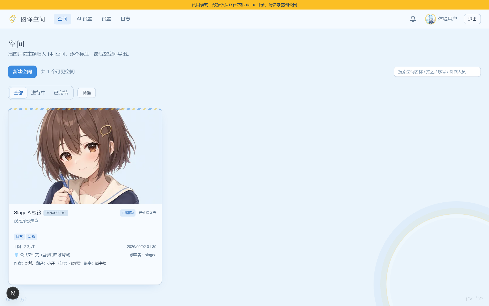
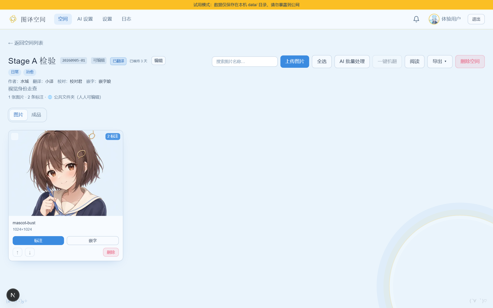
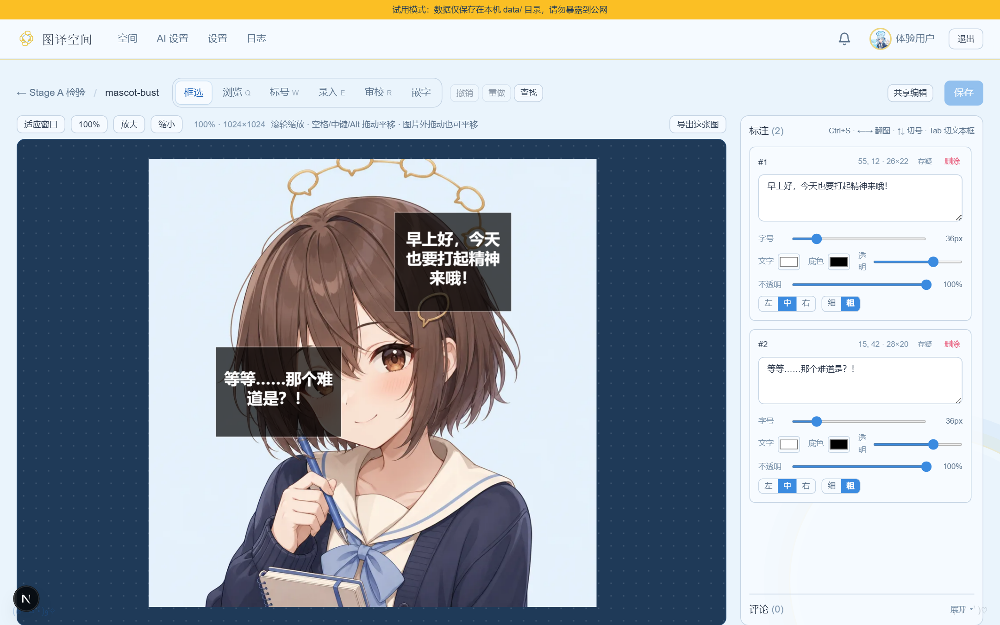
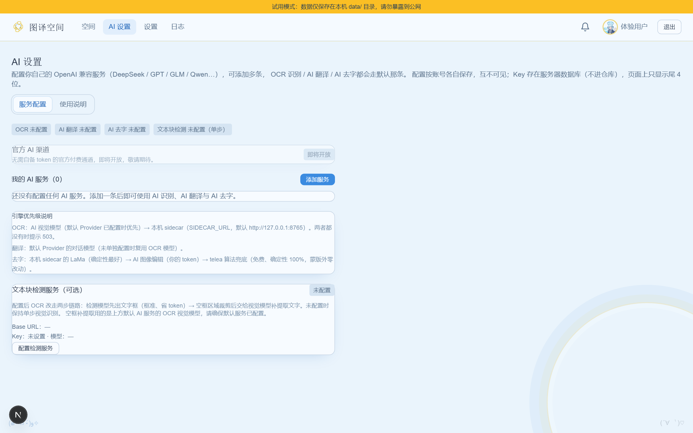
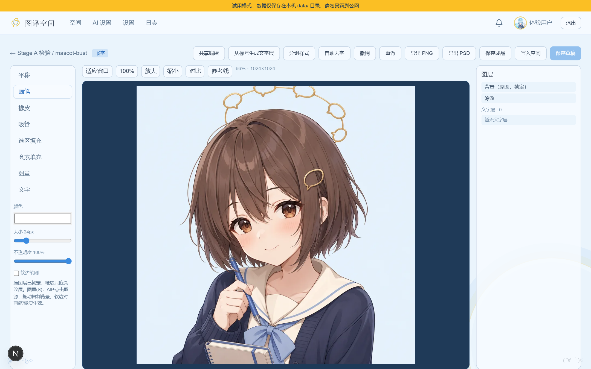
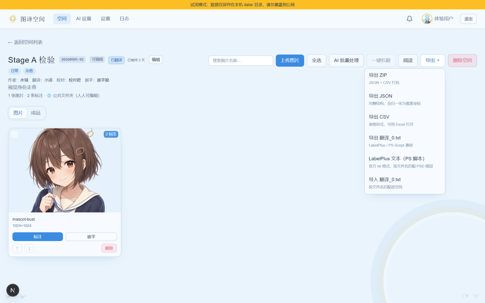

# 图译空间（Tuanyi-Space）完整使用手册

> 本指南参考汉化组通用协作规范编撰，旨在帮助翻译、校对、嵌字及汉化组长快速上手图译空间。

---

## 目录
- [（序）介绍与定位](#序介绍与定位)
- [（一）快速上手：免安装便携版 vs 团队协同版](#一快速上手免安装便携版-vs-团队协同版)
- [（二）空间与项目管理](#二空间与项目管理)
- [（三）翻译与校对工作流（在线标注）](#三翻译与校对工作流在线标注)
- [（四）AI 智能翻译辅助（OCR + 检测 + 翻译）](#四ai-智能翻译辅助ocr--检测--翻译)
- [（五）嵌字工作流：Web 在线嵌字 vs PS 脚本上字](#五嵌字工作流web-在线嵌字-vs-ps-脚本上字)
  - [工作流 A：内置 Web 嵌字器（AI 擦除 + 网页排版一键出图）](#工作流-a内置-web-嵌字器ai-擦除--网页排版一键出图)
  - [工作流 B：LabelPlus + Photoshop 自动化脚本协同](#工作流-blabelplus--photoshop-自动化脚本协同)
- [（六）AI 供应商配置指南](#六ai-供应商配置指南)
- [（七）常见问题与避坑指南（FAQ）](#七常见问题与避坑指南faq)

---

## （序）介绍与定位

**图译空间（Tuanyi-Space）** 是一款面向漫画、插画与条漫汉化团队的现代化在线协作翻译与排版平台。

过去汉化组通常需要结合多种工具（如 LabelPlus 打标客户端、FTP/网盘传图、QQ 群传 txt、Photoshop 逐页手动嵌字），环节繁琐且容易撞车。图译空间吸收了 **萌翻（MoeFlow）** 与 **彩翻（CaiFan）** 在多人协同、标号管理上的优秀经验，并在此基础上实现了革命性的突破：**将“文字标注、AI 翻译、智能去字（Inpainting）与在浏览器中直接完成嵌字出图”全链路一体化整合！**



### 核心特性对比一览

| 能力模块 | 传统单机（LabelPlus） | 萌翻 / 彩翻 | 图译空间（Tuanyi-Space） |
| :--- | :--- | :--- | :--- |
| **部署与运行** | Windows 本机客户端 | 复杂 Docker/多容器集群 | **双模**：单机绿色便携包（开箱即用）/ 团队公网服务 |
| **协同打标** | 仅单人本地打标 | 网页多人在线协作 | **网页实时多人协同**（支持加锁、实时状态广播） |
| **制作人员流转** | 手动记录 | 角色栏显示与状态记录 | **空间制作人员独立字段（作者/翻译/校对/嵌字）+ 7 级细粒度进度状态** |
| **PS-Script 导出** | 支持原版 `翻译_0.txt` | 需转换导出 `translations.txt` | **100% 原生对齐 `images/翻译_0.txt`**，解压即用 |
| **AI 识别与翻译** | 无 | 支持配置 API 跑大模型（鸠三样） | **多 Provider 切换 + 术语表（Glossary）注入 + Sidecar 检测管线** |
| **Web 在线嵌字** | ❌ 无 | ❌ 无（必须导出到 PS） | **✅ 原生支持！** 浏览器内字体排版、字号微调、横竖混排 |
| **AI 智能去字修图** | ❌ 无 | ❌ 无（需人工在 PS 修图） | **✅ 原生支持！** 集成 LaMa / IOPaint AI 消除原图文字 |

---

## （一）快速上手：免安装便携版 vs 团队协同版

图译空间提供两种使用姿态：

### 1. 单人/本地试用模式（Portable 绿色版）
适合个人汉化、单兵作战或临时本地处理。
- 从 GitHub Releases 下载 `tuanyi-space-trial-win64.zip`；
- 解压到任意独立文件夹，双击 `start.bat`；
- 系统会自动拉起内置运行时并在浏览器打开 `http://localhost:3000`；
- **免登录、无需注册**，数据全部保存在解压目录下的 `data/` 文件夹中。

### 2. 团队公网协同模式
适合多人汉化组共享服务器协作。
- 管理员按照 README 部署在云服务器或局域网；
- **邀请注册制**：普通成员需凭管理员生成的**邀请码**注册账号；
- 登录后可在个人中心（右上角头像）设置自己的昵称与个性头像。

---

## （二）空间与项目管理

空间（Space）即一个汉化项目（如单行本的一话、一篇短篇或一本同人本）。



1. **新建空间**：
   - 在空间管理页点击「新建空间」；
   - 填写空间名称（如 `[水城] 某日常篇 第01话`）、描述与标签（如 `日常`、`纯爱` 等）。
   - 系统将自动生成全局唯一的空间序号（格式为 `YYYYMMDD-NN`，方便群内汇报交流）。
2. **制作人员认领与登记**：
   - 空间详情页支持记录四个核心栏目：**作者、翻译、校对、嵌字**；
   - 组内成员可随时编辑填入自己或搭档的 ID，空间列表支持按制作人员一键检索，再也不用担心“这篇是谁翻的/谁在嵌”。
3. **七级协同进度体系**：
   - 空间支持 7 级标准化流转状态：
     - `未翻译` → `翻译占坑` → `已翻译`
     - → `校对占坑` → `已校对`
     - → `嵌字占坑` → `嵌字完成`
   - 卡片上会实时展示「当前状态已维持 X 天」，组长一眼即可洞察各作品的排期卡点。
4. **批量上传图源**：
   - 支持直接拖拽几十甚至上百张图片批量上传；
   - 自动读取图片原始宽高并生成低带宽缩略图；
   - 支持拖拽卡片调整页面顺序（对齐漫画阅读顺序）。

---

## （三）翻译与校对工作流（在线标注）

点击空间内的任意图片条目，即可进入**在线标注与翻译编辑器**。



### 1. 基础标号操作
- **新建标注框**：在画布上按住鼠标左键拖拽框选台词气泡；
- **微调气泡**：选中框体后可自由拖动把手缩放位置，自适应任何异形对话框；
- **输入译文**：点击选中右侧对应的序号文本框，直接录入中文译文；
- **实时自动保存**：所有标注和文字修改均毫秒级自动入库，无须频繁手动 Ctrl+S，右侧会有「已保存」状态指示。

### 2. 高效快捷键表
| 快捷键 | 功能描述 |
| :--- | :--- |
| `Alt + X` | **切换疑点标记**（高亮标黄，方便校对和嵌字重点复核复杂双关或生僻字） |
| `Delete` / `Backspace` | 删除当前选中的标注框 |
| `Ctrl + S` | 强制触发即时保存（正常已有自动保存兜底） |
| `Space + 拖动` | 画布平移抓手 |
| `滚轮 / 双指` | 缩放画布视图（最大支持 800% 细节特写） |

### 3. 多人防撞车机制
- 房间右上角显示当前共同编辑成员头像；
- 当有成员正在该页标注时，系统自动锁定协同锁，防止多人同时修改产生译文覆盖；心跳超时后自动安全释放。

---

## （四）AI 智能翻译辅助（OCR + 检测 + 翻译）

图译空间内置成熟的 AI 辅助流水线（俗称“鸠三样”进阶版）：



1. **一键识别并翻译**：
   - 在标注器右上角点击「AI 翻译」；
   - 系统将自动提取画面、调用视觉大模型检测日文台词框、识别日文生肉原句，并直接给出地道的中文译文。
2. **术语表（Glossary）注入**：
   - 空间支持配置专属术语对照表（如角色名、世界观专有名词、技能名称）；
   - 在 AI 识别与翻译阶段，系统会自动将术语表作为上下文约束注入 Prompt，保证专有名词全篇翻译严格一致。
3. **校对与采纳**：
   - AI 结果返回后，以候选框的形式叠加显示；
   - 翻译人员可逐个复核、点击「采纳」合并至正式标注列表，或人工做润色调整。

---

## （五）嵌字工作流：Web 在线嵌字 vs PS 脚本上字

图译空间同时支持 **“浏览器内直出成品”** 与 **“导出 Photoshop 脚本打标”** 双套工作流，汉化组可根据作品类型与嵌字习惯灵活选用：

### 工作流 A：内置 Web 嵌字器（AI 擦除 + 网页排版一键出图）
> **适用场景**：条漫、推特短篇、日常单页、无复杂背景特效字、追求极致时效的作品。无需安装 Photoshop，手机/平板/网页均可完成全流程！



1. **进入排版工作台**：在条目页或详情页点击「在线嵌字」；
2. **文字样式调优**：
   - 快速切换**竖排**（日漫传统）或**横排**；
   - 调整字号比例、文本对齐方式（居中、左对齐）；
   - 设置文字颜色、描边粗细与描边颜色（黑字白边/白字黑边一键切换）；
   - 字体选择：支持思源黑体、思源宋体以及组内上传的各种个性 TTF 字体；
3. **AI 智能去字修图（Inpaint）**：
   - 框选原图对话框中的日文原字，点击「AI 去字」；
   - 内置图像算法将智能感知台词气泡背景并自动抹平原文字，省去 PS 仿制图章的繁重体力活；
4. **直出成品**：
   - 排版完成后点击「导出成品」，直接生成高质量 PNG/JPEG 成果图；
   - 空间详情页支持「一键打包导出全部已嵌图片」，直接交付发布！

---

### 工作流 B：LabelPlus + Photoshop 自动化脚本协同
> **适用场景**：长篇连载、高精商业单行本、包含大量复杂手写特效字、网点背景修图的重度嵌字工程。



1. **导出准备**：
   - 在空间详情页勾选需要导出的图片（或不勾选默认全选）；
   - 点击右上角「导出」；
   - 选择**【导出完整 ZIP】**（包含原图与 `翻译_0.txt`）。
2. **标准目录解压**：
   - 解压下载的 ZIP 包，目录结构如下：
     ```text
     [20260905-01] 某日常篇 第01话/
     ├── README.txt           # 空间信息与使用指引
     └── images/              # 原图与打标数据严格同级
         ├── 001.jpg
         ├── 002.png
         └── 翻译_0.txt       # LabelPlus 标准格式翻译数据
     ```
   - **关键机制**：图译空间导出的 `翻译_0.txt` 严格与图片保存在同一 `images/` 目录下，且文本内 `[Page_001]` 引用与图片文件名 `001.jpg` 精确对齐！
3. **运行 Photoshop 脚本批量上字**：
   - 打开 Adobe Photoshop；
   - 将 [`LabelPlus_Ps_Script.jsx`](https://github.com/LabelPlus/PS-Script) 直接拖入 PS 窗口；
   - 浏览选择 `images/翻译_0.txt`，脚本会自动定位同目录下的所有图片；
   - 点击「开始导入」，PS 将自动为每张图片生成对应的文本图层并分层保存在 `output/` 文件夹的 PSD 工程文件中；
   - 嵌字人员只需打开 PSD 对字体、字距做艺术微调即可！

---

## （六）AI 供应商配置指南

在顶部导航栏点击 **「AI 服务」**，即可按个人或全站需求配置各大主流大模型：

1. **支持的 Provider 类型**：
   - **DeepSeek**：性价比极高（如 `deepseek-chat`），推荐用于纯文本翻译；
   - **Qwen（通义千问）**：视觉多模态能力出众（如 `qwen-vl-max`、`qwen2.5-vl`），推荐用于台词检测与生肉 OCR；
   - **OpenAI / Claude / Gemini 兼容中转**：填入标准 `Base URL` 与 `API Key` 即可；
   - **本地私有化模型**：支持连接本地 Ollama、vLLM、LM Studio（如 `http://localhost:11434/v1`），完全离线零 Token 费用。
2. **参数推荐参考**：
   - 基础端点（Base URL）：`https://api.deepseek.com/v1` 或各类聚合平台端点；
   - OCR 视觉模型（OCR Model）：填入多模态视觉模型名称；
   - 翻译模型（Chat Model）：填入语言大模型名称。

---

## （七）常见问题与避坑指南（FAQ）

### Q1：为什么导出的 `翻译_0.txt` 必须放在 `images/` 目录下？
**A**：这是根据 [LabelPlus/PS-Script](https://github.com/LabelPlus/PS-Script) 官方规范设计的最佳实践。PS 脚本在运行加载 txt 时，默认会从“当前 txt 所在的目录”扫描待嵌字的原图。如果两者分离在不同文件夹，PS 脚本就会弹出报错“找不到对应的图片文件”。将两者统一置于 `images/` 下能实现解压即可一键运行，免去手动选图的麻烦。

### Q2：PS 脚本导入时提示“存在无法匹配的图源文件”怎么办？
**A**：通常由以下两种原因引起：
1. **文件名包含特殊 Emoji**：原图文件名中若带有颜文字或特殊表情符号，部分旧版本 Photoshop 的 JSX 引擎无法解析。在图译空间中上传时，系统会自动标准化图源命名（如 `001.jpg`、`002.png`），直接导出即可避免该问题。
2. **勾选漏页**：检查导出时是否只导出了部分图片，但在 txt 中仍保留了全本索引。图译空间的导出引擎会自动根据你勾选的图片动态剪裁 `翻译_0.txt`，确保导出的图与 txt 内容严格一致。

### Q3：手机或 iPad 可以使用图译空间吗？
**A**：完全可以！图译空间的前端界面经过移动端响应式适配。在手机或平板浏览器中访问，同样可以查看空间状态、认领制作人员，并使用触屏进行译文录入与校对。

### Q4：便携版的本地数据如何备份与迁移？
**A**：便携版的所有数据（包括 SQLite 数据库、上传的原图、生成的标注与成品）全部存放在程序根目录的 `data/` 文件夹中。只需将 `data/` 文件夹完整复制，即可在任意电脑或新版本之间无缝迁移！
